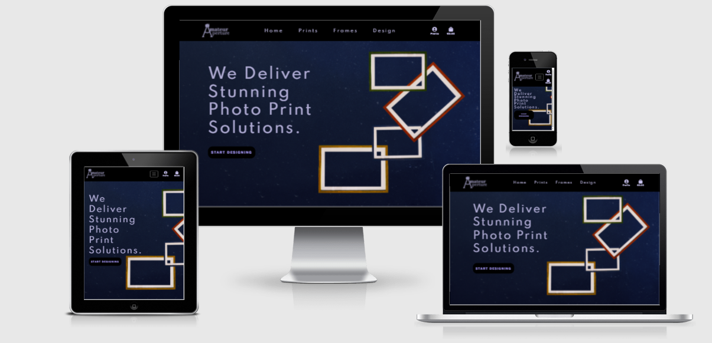
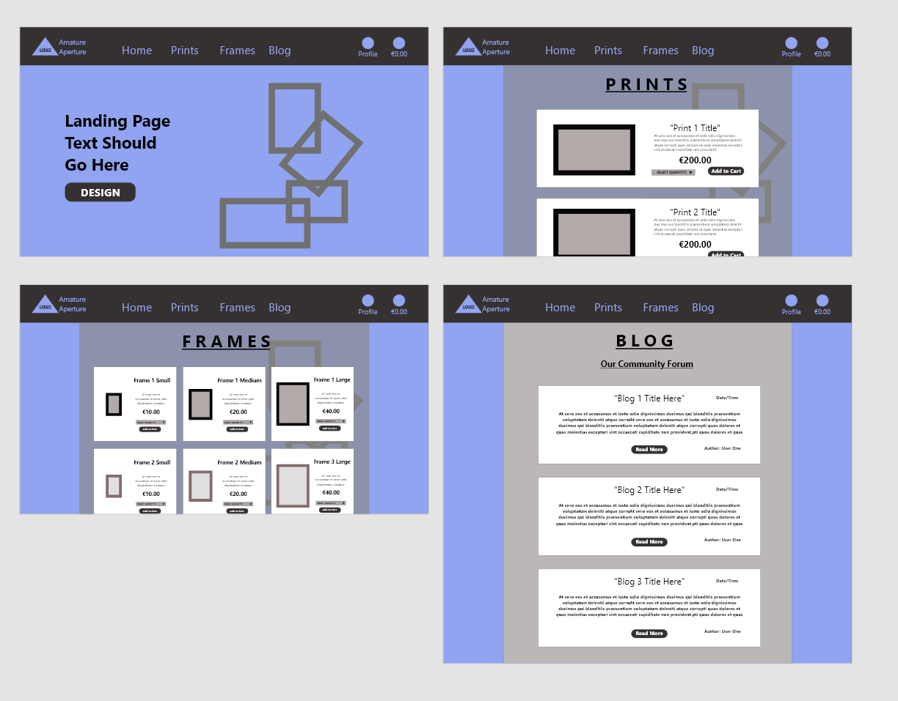
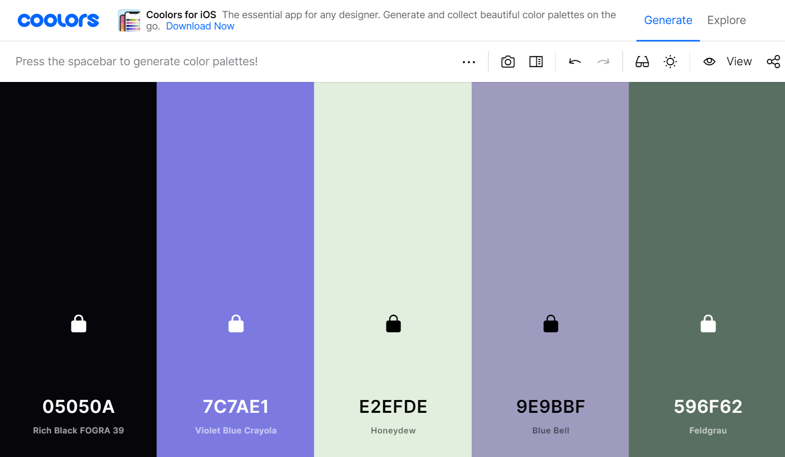

# Milestone project 4: Photo Print Store

### Using: HTML, CSS, JavaScript, Python, Django, Flask, Bootstrap, PostgreSQL, Stripe

#### Purpose - This project will build a full-stack site based around business logic used to control a centrally-owned dataset. Including an authentication mechanism and the provision paid access to the site's data and/or other activities based on the dataset, such as the purchase of a product/service.
---

## Project Summary:
### The goal of this project is to design and create an image printing, e-commerce web based application. This will be done using Python on the Django framework, written in HTML & Css and using JavaScript for further functionality. The main goal of the web app owner will be to provide a platform for customers to upload their image files to be printed (and possibly framed) and then purchased using a secure payment which allows user profiles to persist a shopping bag and return to checkout at a future time. 

### Link to Live Site - "#"

A digital render of how the site would look on different devices and screen sizes 

### Contents - 

* [**STRATEGY**](#strategy)

* [**USER STORIES**](#user-stories)

* [**SCOPE**](#scope)

* [**STRUCTURE**](#structure)

* [**SKELETON**](#skeleton)

* [**SURFACE**](surface)

* [**FEATURES**](#features)

* [**FUTURE FEATURES**](#future-features)

* [**TECHNOLOGIES USED**](#technologies-used)

* [**TESTING**](#testing)

* [**BUG FIXES**](#bug-fixes)

* [**IMPLEMENTATION ISSUES**](#implementation-issues)

* [**DEPLOYMENT**](#deployment)

* [**CREDITS**](#credits)

* [**CONTENT**](#content)

* [**MEDIA**](#media)

* [**ACKNOWLEDGEMENTS**](#acknowledgements)

### **STRATEGY**

#### SITE OWNER GOALS:
The main goal of this project is to create a photograph printing e-commerce store which also offers users to oppourtunuity to purchase photoframes and other artist's work. 

Target Audience: Photograpghers, Artists, General public 

### **User stories**

Website user -

1. As a user I want a visually appealing and smooth website experience
2. As a user I want to be given visual feedback about my actions 
3. As a website user I want to be able to navigate the website easily and intuitively
4. As a user I want a consistent experience, that is the same every time I come back to the website and on any device
5. As a user I want to reigister for a profile that is protected by a password
6. As a user I want to be able to login and logout of my account
7. As a user I want to personalise my user account
8. As a user I want to receive email confirmation to register my account

Customer  - 

9. As a customer I want to view products for sale in distinct categories 
10. As a customer I want to view the particular details of products   
11. As a customer I want to add products to a shopping bag before checking out   
12. As a customer I want to change the quantity of the items I add to my bag
13. As a customer I want to checkout my bag of items in a safe and reputable environment 

Website Owner - 

14. As the website owner I want to make money by offering goods to the users
15. As the website owner I want the users to enjoy using my application
16. As the website owner I want users to stay on my site for as long as possible
17. As the website owner I want the users to return to my website
18. As the website owner I want users to be able to trust the security and payment features that I have implemented

### **SCOPE**

This project will be a minimal viable product containing the aspects that are vital to functionality and an acceptable standard of aesthetic value, but with lots of opportunity to develop further in the future.

Functional specifications: 
- Navigation (Top Navbar)
- Login/Logout features
- Password protected user accounts
- Checkout bag for customers (including bag preview)
- Stripe payments
- Allow admin to create, edit and delete items

Content specifications:
- Data retrieval display (from Popstrgres using Flask)
- Custom artwork

### **STRUCTURE**

The website is laid out over 7 pages which can be broken down into 6 seperate areas. 
These areas are:

1. Landing Page 
2. Frames Page 
3. Prints Page 
4. Design Page 
5. Registration Page ( for new users)
6. Login/Logout Pages (for existing users to login in using a username and password)

The database used for this project is Postgres, the relational logic of this type of database was suitable for the purposes of this project.

### **SKELETON**

Differences between final design and wireframes:

 

##### Created at the outset of the project to direct the stylistic development. 

### **SURFACE**

Typography -
Two fonts were chosen for this project - 

The first of which is 'Spartan' - This font was chosen for it's elegant and artistic aesthetic which gives the user a sense of a classic art print style.

 

The second font used is 'Alata' – This font was chosen because it's a stylish and non-distracting font and used for small print where needed.

 

Colour scheme -

The author used Coolers.com to create a consistent and visually appealing colour palette for this project. Accessibility was also a concern so the author ensured that all colours of text used were done in a highly contrasting and visually pleasing manner .

 

Images -

All images were designed and created by the author.

### **FEATURES**

- Media responsiveness on all device sizes
- Navigation buttons that link to all pages
- Navigation buttons includes user feedback for click
- User can create unique login name and password to protect persistent checkout bag
- User can upload and preview images for printing in 'Design' page
- Admin can create, edit and delete saleable items
- Profile page with database query feedback (previous checkout orders)

### **FUTURE FEATURES**

- Public gallery of previously ordered images
- Login from social media accounts
-

### **TECHNOLOGIES USED**

Python - For creating main application and majority of functionality

Django - As the framework applications are built and maintained through

Postgres - For storing and accessing Database

Flask - For wrapping functions and tools (Jinja and Werkzeug)

HTML – For creating pages

Css – For styling pages

Bootstrap – For design components and front end elements

JavaScript – For creating additional functions and interactive elements on project

JQuery - For initialising Materiaze components 

Heroku - For application deployment

Adobe XD – For creating wireframes

Adobe Photoshop – For editing images to consistent sizes and adjusting styles

Git – Used for Version control

Gitpod – For code editing and testing

GitHub – For storing repository

Chrome Dev Tools – For editing changes in real time and checking styles in different media sizes

Chrome Lighthouse – For checking page performance

W3C CSS - For validating CSS code

W3C HTML – For validating and ensuring HTML code was correct/valid.

Coolers (website) - For creating a custom colour palette for project

FreeFormatter (website) - For validating HTML code

AutoPrefixer Online – For CSS parsing and adding vendor prefixes

AmIResponsive (website) - To ensure site is responsive and create mockup

### **TESTING**

#### **Code tests -**

The CSS code was passed through W3C CSS Validator and final version contained no errors. It was also passed through AutoPrefixer Online to parse CSS and add vendor prefixes to ensure validity.

The HTML code was passed through W3C HTML Validator and FreeFormatter.com to ensure final version contained no errors.

The JavaScript was tested using JSHint to ensure no errors included in final version. 

The Python code was tested using 'Python Tutor' and 'Extends Class - Python Syntax Checker'

#### **Dev tests -**

(i)Chrome Developer Tools -

Chrome Developer Tools were used throughout this project and were greatly relied on to make all manner of adjustments and changes to project.

(ii)Chrome Lighthouse -

Chrome Lighthouse was used to ensure that the website has been deployed in the most efficient way possible – the screen shots below reflect the score of this project under four headings 
    • Performance
    • Accessibility
    • Best Practices
    • SEO
 

These changes included - 
1. Performance: 
    • 

2. Accessibility:
    • 

 
3. Best Practices:
     • 

4. SEO:
    • 

#### **Function tests -**

This site was tested many times manually throughout the development process by the author and friends and family to ensure that it's functions behave exactly as they are intended to. This process was again repeated when hosted to ensure that there were no changes to functionality. 

Below are a list of the 
- Test cases
- Expected behaviour
- Observed Results
- Summary of expected behaviour and results 

Tests will be applied to all the pages included in the project, these pages will be referred to as:

 1. Home Page
 2. Prints Page
 3. Frames Page
 4. Design Page
 5. Profile Page
 6. Login/Register Page
 
**Test Case I:** Initial Page Load and display

1. Home Page - 
- Expected Behaviour: Page will load correctly and promptly, with all elements in place where they should be.
- Observed Results: When loaded this page loaded without any issue and in a time that was satisfactory.
- Test Summary: There was no outstanding differences between the expected behaviour of this test and the observed results. 

2. Prints Page - 
- Expected Behaviour: Page will load correctly and promptly, with all elements in place where they should be.
- Observed Results: When loaded this page loaded without any issue and in a time that was satisfactory.
- Test Summary: There was no outstanding differences between the expected behaviour of this test and the observed results. 

3. Frames Page - 
- Expected Behaviour: Page will load correctly and promptly, with all elements in place where they should be.
- Observed Results: When loaded this page loaded without any issue and in a time that was satisfactory.
- Test Summary: There was no outstanding differences between the expected behaviour of this test and the observed results. 

4. Design Page - 
- Expected Behaviour: Page will load correctly and promptly, with all elements in place where they should be.
- Observed Results: When loaded this page loaded without any issue and in a time that was satisfactory.
- Test Summary: There was no outstanding differences between the expected behaviour of this test and the observed results. 

5. Profile Page - 
- Expected Behaviour: Page will load correctly and promptly, with all elements in place where they should be.
- Observed Results: When loaded this page loaded without any issue and in a time that was satisfactory.
- Test Summary: There was no outstanding differences between the expected behaviour of this test and the observed results. 

6. Login/Register Page - 
- Expected Behaviour: Page will load correctly and promptly, with all elements in place where they should be.
- Observed Results: When loaded this page loaded without any issue and in a time that was satisfactory.
- Test Summary: There was no outstanding differences between the expected behaviour of this test and the observed results. 

**Test Case II:** 

**Test Case III:** Error 404 Page

Error 404 Page - 
- Expected Behaviour: If a user inputs an incorrect HTML the custom 'Error 404' HTML page should be displayed, including navigation back to other pages of website. 
- Observed Results: When an incorrect HTML was entered the user was redirected to custom Error 404 page, which had buttons on top to re-direct back to all other pages of website.  
- Test Summary: There was no outstanding differences between the expected behaviour of this test and the observed results. 

#### **Response tests -**

The site was tested across all media query sizes and at all possible breaking points to ensure that a consistent and responsive experience was ensured for the user on any device. 

The author also used AmIResponsive.com to ensure that this was confirmed through an outside, objective source.

#### **Browser tests -**

Though the sote was developed through Google Chrome, after it had been deployed online it was tested across all other major browsers to make sure that it was fully operational. These browsers included 
- Chrome
- Safari
- Firefox
- Opera

#### **User story tests:**

**Website user -**

Website user -

1. As a user I want a visually appealing and smooth website experience

- 
2. As a user I want to be given visual feedback about my actions 

- 

3. As a website user I want to be able to navigate the website easily and intuitively

- 
4. As a user I want a consistent experience, that is the same every time I come back to the website and on any device

- 
5. As a user I want to reigister for a profile that is protected by a password

- 
6. As a user I want to be able to login and logout of my account

- 
7. As a user I want to personalise my user account

- 
8. As a user I want to receive email confirmation to register my account

- 
Customer  - 

9. As a customer I want to view products for sale in distinct categories

- 
10. As a customer I want to view the particular details of products

- 
11. As a customer I want to add products to a shopping bag before checking out

-   
12. As a customer I want to change the quantity of the items I add to my bag

- 
13. As a customer I want to checkout my bag of items in a safe and reputable environment

- 

Website Owner - 

14. As the website owner I want to make money by offering goods to the users

- 
15. As the website owner I want the users to enjoy using my application

- 
16. As the website owner I want users to stay on my site for as long as possible

- 
17. As the website owner I want the users to return to my website

- 
18. As the website owner I want users to be able to trust the security and payment features that I have implemented

- 
### **BUG FIXES**

### **IMPLEMENTATION ISSUES**

### **DEPLOYMENT**

**Git Hub Pages**

This project was developed in the Gitpod development environment. I initialised the project by creating a new repository for the project in GitHub and used this as a storing point to push the project to at various points through out the development process. Using the git add function I staged my code at many times and used the Git Commit command to save all changes. Finally, I used the Git Push command to send all the changes back to my repository on GitHub.

After initial deployment this site could no longer be access through GitHub pages without re-adding the 'env.py' file due to the sensitive information contained within. From this point onwards I accessed the site directly through Gitpod pages or from Heroku. 

**Deployment -**

In the early stages of development I deployed the site live to Heroku - this allowed me to check the site was working across multiple devices and also that I was no longer relying on the 'env.py' file to access this project.

**Creating clone of project -**

To create a clone of this project you can access it through the link on the Git Hub Repository, click the clipboard to copy the url, this can then be brought to the terminal when a new working directory can be set up and the clone saved. Once this is done you can type ‘git clone’ and paste the url and press enter and a new clone will be created.

**Running Clone on local machine -**

If you want to run this clone on a local machine you would go to the 'Clone' section on GitHub and click the url link in the HTTPS section. When you download and unzip these files to your desktop you can then open them in your own IDE shell and save them as a new directory. 

All requirements needed to initialise project can be found i the 'requirements.txt' file. 

### **CREDITS**

#### **General Elements -** 

- Code Institute (Course content & Slack Community)
- 2021 Complete Python Bootcamp From Zero to Hero in Python - Jose Portilla (Udemy)
- 
- 

#### **Specific Elements -** 

**Adding Favicons to Website**
- Dani Krossing: (https://www.youtube.com/watch?v=kEf1xSwX5D8)

**Buttons** 
- FDossena: (https://fdossena.com/?p=html5cool/buttons/i.frag)
- W3Schools: (https://www.w3schools.com/css/css3_buttons.asp)
- Bootstrap Docs: ()

**CSS Animations/Transformation**
-Web Dev Simplified: (https://www.youtube.com/watch?v=YszONjKpgg4)

**CSS Flexbox** 
- Web Dev Simplified: (https://www.youtube.com/watch?v=fYq5PXgSsbE)
- Free Code Camp: (https://www.freecodecamp.org/news/learn-css-flexbox-in-5-minutes-b941f0affc34/)
- CSS Tricks: (https://css-tricks.com/snippets/css/a-guide-to-flexbox/)

**Flask** 
-Flask Documentation: (https://flask.palletsprojects.com/en/2.0.x/patterns/viewdecorators/#login-required-decorator)

**Image Overlay Issues**
-Stack Overflow: (https://stackoverflow.com/questions/36927140/cant-click-the-button-because-of-the-overlay)

**Lighthouse Issues**
- Web.dev: (https://web.dev/image-aspect-ratio/?utm_source=lighthouse&utm_medium=devtools)

**Media Queries**
– CSS Tricks: (https://css-tricks.com/snippets/css/media-queries-for-standard-devices/)
- W3Schools: (https://www.w3schools.com/css/css_rwd_mediaqueries.asp)
- Code Grepper: (https://www.codegrepper.com/code-examples/delphi/bootstrap+hide+image+on+mobile)

**README Editing**
- Adam Pritchard: (https://github.com/adam-p/markdown-here/wiki/Markdown-Cheatsheet)
- Github Support: (https://github.community/t/link-to-a-section-in-another-readme-md-file/1130)
- Next Day Video: (https://www.youtube.com/watch?v=2dAK42B7qtw/)

#### **Other Elements -**

- Cooler.com - Colour scheme generator: (https://www.coolors.co/)

### **CONTENT**

All text content was written by author 

### **MEDIA**

All images were custom designed and created specifically for this project.

### **ACKNOWLEDGEMENTS**

- Code institute
- Mentor (Spencer Shelton)
- Slack Community
- Friends and Family (for testing)

## REQUIREMENTS

----------------

pip3 install -r requirements.txt

Creating New Apps
python3 manage.py startapp 'name'

Add to INSTALLED APPS in Settings.py

Setting Up Django Project
pip3 install django

django-admin startproject boutique_ado . - Creates files we'll need (settings.py, urls.py etc.)

touch .gitignore (create our git ignore file)

python3 manage.py runserver (Run project)

python3 manage.py migrate - To run migrations

python3 manage.py createsuperuser - To create admin user 23rd/09th - sray2021 pword = photoprints1

## Initial Commit

----------------------

Django-Allauth for authorisation
pip3 install django-allauth==0.41.0

Add allauth additional settings to settings and urls.py fils (see video Allauth Setup 1)

Navigate to admin of site - open port 8000 /admin + login details

Migrate app for new additions (python3 manage.py migrate)

Migrations
python3 manage.py makemigrations --dry-run

python3 manage.py makemigrations

python3 manage.py migrate --plan

python3 manage.py migrate

Loading Data
python3 manage.py loaddata frames

python3 manage.py loaddata prints

## Quickstart for project

------------------- 

pip3 install -r requirements.txt

python3 manage.py makemigrations --dry-run

python3 manage.py makemigrations

python3 manage.py migrate --plan

python3 manage.py migrate

python3 manage.py loaddata categories

python3 manage.py loaddata products

export STRIPE_SECRET_KEY=sk_test_51JYSDEAQb6q0x2KwYN4xfF2sbuhyLr1PP3L75QVtfa54AHeOZKL4LtABmw8R5CrElDKq6kDnLfsrMiGvQnmk7SuC00Che5f4US (old)

export STRIPE_PUBLIC_KEY=pk_test_51JYSDEAQb6q0x2KwgVMPWeio4ynVOjfeAOYiTKJY5j1PuNt9fq5ydDkuAeave2L5qf5YqBphC2KCkmhqzVQ0yQxA00dRAxgEED(old)

python3 manage.py runserver

## Heroku Login

---------------------------

If heroku login doesn't work, use

'heroku login -i'

'git push -u heroku' - *** No master!

## Code Refactoring
----------------
python3 -m flake8

## Making Templates 
--------------------

mkdir templates