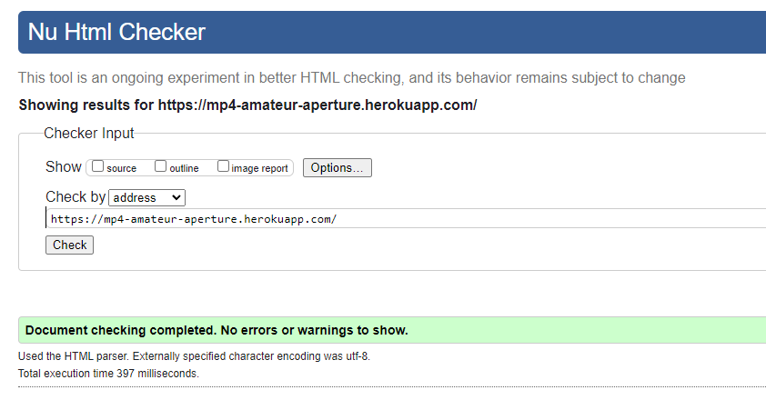
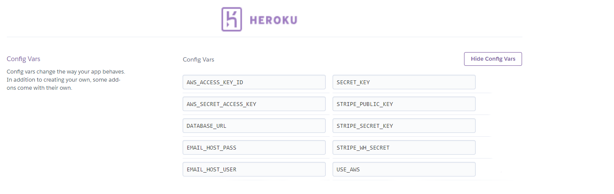

# Code Institute Milestone Project 4: Photo Print Store

### FullStack Django Application

**Built using: HTML, CSS, JavaScript, Python, Django, Flask, Bootstrap, PostgreSQL, Stripe**

 Purpose - This project will build a full-stack site based around business logic used to control a centrally-owned dataset. Including an authentication mechanism and the provision paid access to the site's data and/or other activities based on the dataset, such as the purchase of a product/service.
---

### Project Summary:
 The goal of this project is to design and create a photography e-commerce and community web based application. This will be done using Python on the Django framework, written in HTML & Css and using JavaScript for further functionality. The main goal of the web app owner will be to provide a platform for customers to purchase framed photograph prints and frames using a secure payment service which allows user profiles to persist a shopping bag and return to checkout at a future time. There will also be a community blog component that will allow photographers, artists and other customers to share ideas and discuss featured pieces.

### Link to Live Site - "https://mp4-amateur-aperture.herokuapp.com/"

A digital render of how the site would look on different devices and screen sizes 

### Contents - 

* [**STRATEGY**](#strategy)

* [**USER STORIES**](#user-stories)

* [**SCOPE**](#scope)

* [**STRUCTURE**](#structure)

* [**SKELETON**](#skeleton)

* [**SURFACE**](surface)

* [**FEATURES**](#features)

* [**FUTURE FEATURES**](#future-features)

* [**TECHNOLOGIES USED**](#technologies-used)

* [**TESTING**](#testing)

* [**BUG FIXES**](#bug-fixes)

* [**DEPLOYMENT**](#deployment)

* [**CREDITS**](#credits)

* [**CONTENT**](#content)

* [**MEDIA**](#media)

* [**ACKNOWLEDGEMENTS**](#acknowledgements)

### **STRATEGY**

#### SITE OWNER GOALS:
The main goal of this project is to create a photograph printing e-commerce store which also offers users to oppourtunuity to purchase photoframes and other artist's work. The site will also contain a blog component to give users more ways to engage with the products and content of the site.

Target Audience: Photograpghers, Artists, General Public 

### **User stories**

Website user -

1. As a user I want a visually appealing and smooth website experience
2. As a user I want to be given visual feedback about my actions 
3. As a website user I want to be able to navigate the website easily and intuitively
4. As a user I want a consistent experience, that is the same every time I come back to the website and on any device
5. As a user I want to reigister for a profile that is protected by a password
6. As a user I want to be able to login and logout of my account
7. As a user I want to personalise my user account
8. As a user I want to receive email confirmation to register my account

Customer  - 

9. As a customer I want to view products for sale in distinct categories 
10. As a customer I want to view the particular details of products   
11. As a customer I want to add products to a shopping bag before checking out   
12. As a customer I want to change the quantity of the items I add to my bag
13. As a customer I want to checkout my bag of items in a safe and reputable environment 

Community - 

14. As a community member I want to view blog posts
15. As a community member I want to comment on blog posts 

Website Owner - 

16. As the website owner I want to make money by offering goods to the users
17. As the website owner I want the users to enjoy using my application
18. As the website owner I want users to stay on my site for as long as possible
19. As the website owner I want the users to return to my website
20. As the website owner I want users to be able to trust the security and payment features that I have implemented

### **SCOPE**

This project will be a minimal viable product containing the aspects that are vital to functionality and an acceptable standard of aesthetic value, but with lots of opportunity to develop further in the future.

Functional specifications: 
- Navigation (Top Navbar)
- Login/Logout features
- Password protected user accounts
- Checkout bag for customers (including bag preview)
- Stripe payments
- Allow admin to create, edit and delete products for sale
- Allow admin to create and delete blog posts
- Allow admin to moderate user comments on blog posts

Content specifications:
- Data retrieval display (from Postrgres using Flask)
- Custom artwork

### **STRUCTURE**

The website is laid out over many pages which can be broken down into 10 seperate areas. 
These areas are:

1. Landing Page 
2. Frames Page (Overview and Individual Frames)
3. Prints Page (Overview and Individual Prints)
4. Blog Page (Overview and Individual Posts)
5. Registration Page ( for new users)
6. Sign In/Sign Out Pages (for existing users to login in using a username and password)
7. Profile Page
8. Bag Page
9. Checkout Page
10. Checkout Success Page

#### **Database**

The database used for this project is Postgres, the relational logic of this type of database was suitable for the purposes of this project.

##### **Blog App**

##### **Checkout App**

##### **Products App**

###### Profiles App

### **SKELETON**

Differences between final design and wireframes:

 

##### Created at the outset of the project to direct the stylistic development. 

### **SURFACE**

Typography -
Two fonts were chosen for this project - 

The first of which is 'Spartan' - This font was chosen for it's elegant and artistic aesthetic which gives the user a sense of a classic art print style.

 

The second font used is 'Alata' – This font was chosen because it's a stylish and non-distracting font and used for small print where needed.

 

Colour scheme -

The author used Coolers.com to create a consistent and visually appealing colour palette for this project. Accessibility was also a concern so the author ensured that all colours of text used were done in a highly contrasting and visually pleasing manner .

 

Images -

All images were designed and created by the author.

### **FEATURES**

- Media responsiveness on all device sizes
- Navigation buttons that link to all pages
- Navigation buttons includes user feedback for click & hover
- User can create unique login name and password to protect persistent checkout bag
- User can view blog posts uploaded by admin
- User can comment on blog posts
- Admin can create, edit and delete saleable items
- Admin can create, edit and delete blog posts
- Admin can review and approve (or disapprove) all comments made by users on blog posts
- Profile page with database query feedback (previous checkout orders)
- Toasts to give user specific feedback on current stage of ordering items
- Secure checkout for all saleable items (using Stripe)

### **FUTURE FEATURES**

- Login from social media accounts
- Add more customisation to profiles to develop community aspect of site
- Add images on blog posts to improve user engagement
- Add user reviews to confirmed product purchases
- Add user community comments on reviews

### **TECHNOLOGIES USED**

Python - For creating main application and majority of functionality

Django - As the framework applications are built and maintained through

Postgres - For storing and accessing Database

Flask - For wrapping functions and tools (Jinja and Werkzeug)

HTML – For creating pages

Css – For styling pages

Bootstrap – For design components and front end elements

JavaScript – For creating additional functions and interactive elements on project

JQuery - For initialising Materiaze components 

Heroku - For application deployment

Adobe XD – For creating wireframes

Adobe Photoshop – For editing images to consistent sizes and adjusting styles

Git – Used for Version control

Gitpod – For code editing and testing

GitHub – For storing repository

Chrome Dev Tools – For editing changes in real time and checking styles in different media sizes

Chrome Lighthouse – For checking page performance

W3C CSS - For validating CSS code

W3C HTML – For validating and ensuring HTML code was correct/valid.

Coolers (website) - For creating a custom colour palette for project

FreeFormatter (website) - For validating HTML code

AutoPrefixer Online – For CSS parsing and adding vendor prefixes

AmIResponsive (website) - To ensure site is responsive and create mockup

### **TESTING**

#### **Code validation tests:**

**CSS:**

The CSS code was passed through W3C CSS Validator (https://jigsaw.w3.org/css-validator/) and the final version contained no errors. It was also passed through AutoPrefixer Online to parse CSS and add vendor prefixes to ensure validity.

**HTML:**

The HTML code was passed through W3C HTML Validator (https://validator.w3.org/) to ensure final version contained no errors. 
This was done by passing every seperate URL page of the application through the validator to make sure that there were no errors on any
of the individual pages. By passing the URL's the validator doesn't read the django/flask and can validate accurately.

**Python:**

The Python code was tested using -

    • Pylinter on Gitpod
    • Python Flake8 library
    • PEP8 online (http://pep8online.com/)

**Pylinter & Flake8 -**

The Pylinter on Gitpod and Flake8 continue to give me a number of errors (which do not appear on PEP8). 

They are the following - 

1. In amateur_aperture / settings.py - The two issues are 'env' imported but unused and Unable to import 'env' - after research on the slack channel and online and from a discussion with my Mentor I believe that these should be ignored as although I am not using the 'env' in this instance it is necessary for local deployment.

2. In checkout / apps.py - Flake8 states that 'checkout.signals' is imported but unused - This app is configured exactly as shown in the Django Full Stack Boutique_Ado project and from my research this is a necessary import for checkout to function correctly.

3. In checkout, products, profiles / models.py - Flake8 and the Pylinter both advise to 'Avoid using null=True on string-based fields' - These settings were taken over from the Boutique_Ado Project and I could not find another way to get the desired functionality effect that this setting provides. Until my knowledge improves and I can find a better way to do this I left the code as it is.

4. In checkout / webhook_handler - Flake8 states that 'django.core.mail.send_mail', 'django.template.loader.render_to_string' and 'django.conf.settings' are all imported but unused - The webhook handler settings for this app are configured exactly as shown in the Django Full Stack: Boutique_Ado Project and from my research this is necessary for the webhook handler to function correctly.

5. In products / models.py - Flake8 and the Pylinter both advise that 'Model does not define __str__ method' - I have tried to replace this method but it causes errors with the models.

**PEP8 -**

All the code in this project has been tested against PEP8 standards and is fully compliant.

However there was one error that caused me some problems. After extensive online research and some help from another CI student on Slack I was able to find a way to write this code
without it causing a syntax - end of line (EOL) error. The line is copied below - 

        'django.contrib.auth.password_validation.UserAttributeSimilarityValidator',

In it's place I replaced the whole 'AUTH_PASSWORD_VALIDATORS' section with the following to make it PEP8 compliant - 

        AUTH_PASSWORD_VALIDATORS = [
            {'NAME': 'django.contrib.auth.password_validation.%s' % validator}
            for validator in [
                'UserAttributeSimilarityValidator',
                'MinimumLengthValidator',
                'CommonPasswordValidator',
                'NumericPasswordValidator',
            ]
        ]

The code was taken from the following source - https://code.djangoproject.com/ticket/28163#no1

**JavaScript:**

The JavaScript was tested using JSHint to ensure no errors included in final version.

#### **Dev tests -**

(i)Chrome Developer Tools -

Chrome Developer Tools were used throughout this project and were greatly relied on to make all manner of adjustments and changes to project.

(ii)Chrome Lighthouse -

Chrome Lighthouse was used to ensure that the website has been deployed in the most efficient way possible – the screen shots below reflect the score of this project under four headings 
    • Performance
    • Accessibility
    • Best Practices
    • SEO
 

These changes included - 
1. Performance: 
    • Performace can be improved by serve images in next-gen formats
    • Image elements do not have explicit width and height

2. Accessibility:
    • No changes could be implemented to improve this score at this time

 
3. Best Practices:
    • No changes could be implemented to improve this score at this time

4. SEO:
    • Add meta description to project
    • Improve crawlability of href attribute of anchor elements links

#### **Function tests -**

This site was tested many times manually throughout the development process by the author and friends and family to ensure that it's functions behave exactly as they are intended to. 
This process was again repeated when hosted to ensure that there were no changes to functionality. 

Below are a list of the 
- Test cases
- Expected behaviour
- Observed Results
- Summary of expected behaviour and results 

Manual tests applied to all the pages included in the project -

1. Landing Page 
2. Prints Page (Overview and Individual Prints)
3. Frames Page (Overview and Individual Frames)
4. Blog Page (Overview and Individual Posts)
5. Registration Page ( for new users)
6. Sign In/Sign Out Pages (for existing users to login in using a username and password)
7. Profile Page
8. Bag Page
9. Checkout Page
10. Checkout Success Page
 
**Test Case I:** Cookie banner pops up on all page links (first time user's browser lands on page)

(i)Landing Page, (ii)Prints Page (iii)Frames Page, (iv)Blog Page, (v)Registration Page, (vi)Sign in/Signout, 
(vii)Profile Page, (viii)Bag Page, (ix)Checkout Page, (x)Checkout Success Page -

- Expected Behaviour: Cookie banner pops up on bottom of any page link until the 'Accept and Close' is clicked. This information should be stored in local storage (cookies).
- Observed Results: When user originally lands on website the cookier banner pops up on the bottom of the page. This remains if any link on the site was clicked and remains until user accepts terms and this information is stored in the application's local storage, until removed.
- Test Summary: There was no outstanding differences between the expected behaviour of this test and the observed results. 

**Test Case II:** Initial Page Load and display

(i)Landing Page, (ii)Prints Page (iii)Frames Page, (iv)Blog Page, (v)Registration Page, (vi)Sign in/Signout, 
(vii)Profile Page, (viii)Bag Page, (ix)Checkout Page, (x)Checkout Success Page -

- Expected Behaviour: Page will load correctly and promptly, with all elements in place where they should be.
- Observed Results: When loaded this page loaded without any issue and in a time that was satisfactory.
- Test Summary: There was no outstanding differences between the expected behaviour of this test and the observed results. 

**Test Case III:** Navigation and page links all work correctly

(i)Landing Page, (ii)Prints Page (iii)Frames Page, (iv)Blog Page, (v)Registration Page, (vi)Sign in/Signout, 
(vii)Profile Page, (viii)Bag Page, (ix)Checkout Page, (x)Checkout Success Page -

- Expected Behaviour: Pages will allow user to click links on navbar and will be re-directed back to the relevant page
- Observed Results: When all navbar and page links were clicked on the above pages the pages directed to where they were supposed to
- Test Summary: There was no outstanding differences between the expected behaviour of this test and the observed results. 

**Test Case IV:** Toasts display to User (Success, Error, Info and Warnings)

(ii)Prints Page, (iii)Frames Page, (iv)Blog Page, (v)Registration Page, (vi)Sign in/Signout, 
(vii)Profile Page, (viii)Bag Page, (ix)Checkout Page, (x)Checkout Success Page -

- Expected Behaviour: When toast triggers were set off on the above pages, a corresponding message should display on screen
- Observed Results: When the toasts were triggered they displayed on the top of the page to give user feedback as to specific actions they were taking.
- Test Summary: There was no outstanding differences between the expected behaviour of this test and the observed results. 

**Test Case V:** New User registration 

(v)Registration Page

- Expected Behaviour: When a new user clicks the register button they should be given a form to complete. When this is done they will be sent a confirmation email to ensure they are really connected to the email account. 
- Observed Results: When user entered the required details a confirmation email was sent to the email address they gave and when the link in this email was followed and clicked they could confirm their account. Once this was completed they could login and logout as often as they wanted adn their profile information was saved.
- Test Summary: There was no outstanding differences between the expected behaviour of this test and the observed results. 

**Test Case VI:** Login and Logout functionality

(vi)Sign in/Signout, 

- Expected Behaviour: When a user clicks 'Sign In' they should be able to put in their username or email address and password and then have access to all user elements of the site (including persistent shopping bag and personal info saved in the profile tab). When the 'Sign Out' button is clicked user should be asked to confirm logout and if the affirmative is selected they should be logged out and there be no personal information attached to that session.
- Observed Results: When the correct login details were entered user was able to see past orders on the profile app and also that items they had added to the bag previously were still there. When signout was clicked they were asked if they wanted to signout and when yes was clicked their profile was removed from the session.
- Test Summary: There was no outstanding differences between the expected behaviour of this test and the observed results. 

**Test Case VII:** Send items to bag and bag persist functionality

(ii)Prints Page, (iii)Frames Page, (viii)Bag Page, 

- Expected Behaviour: When user clicks 'add to bag' on a product it should be added to the users bag for review and checkout. If the user wants to delete an item or update the  quantity they should be able to using the corresponding buttons. This bag should be persistent if the user logs out and the back in they should be able to complete this order. 
- Observed Results: When 'Add to bag' was clicked on a product it was added to bag. On the bag page the user could click the increment or decrement button and then the update button the item quantity was updated. When the delete button was clicked the item was removed. When items were added to the bag and the user logged out, the same items were still there when they logged back in. 
- Test Summary: There was no outstanding differences between the expected behaviour of this test and the observed results. 

**Test Case VIII:** Checkout bag works

(viii) Bag Page, (ix)Checkout Page, (x)Checkout Success Page, 

- Expected Behaviour: When user enters correct personal and credit card details and they should be re-directed to the Checkout success page where the payment will be confirmed and the order should be stored in the database which can be viewed by the user in their profle page
- Observed Results: When the test Stripe payment details were entered on the checkout page along with some test personal details there was an overlay which waited several seconds and then redirected to the payment success page where a copy of the order was displayed. After this when looking at the user profile page a copy of this order was accessible with all the previous order information. 
- Test Summary: There was no outstanding differences between the expected behaviour of this test and the observed results. 

**Test Case IX:** Edit and Delete Functionality for Admin on Product pages

 (ii)Prints Page, (iii)Frames Page -  

- Expected Behaviour: When an Admin (superuser) is logged in they should be able to edit and delete products (Prints and Frames) directly from the product details pages on live website. For extra security, if delete is clicked an alert will popup to prevent accidental deletes and get admin to confirm delete.
- Observed Results: When user was logged in as superuser the 'edit' and 'delete' buttons were displayed on the product details pages. When edit was clicked it brought admin to the product edit page and when 'update' button was pressed it allowed user to change the details of any existing object. When the delete button was pressed an alert popped up on the top of the screen which asked the user "Are you sure they want to delete item" if user presses 'Cancel' the object is not deleted and if 'Okay' is pressed then the item is deleted. 
- Test Summary: There was no outstanding differences between the expected behaviour of this test and the observed results. 

**Test Case X:** CRUD Functionality for Admin 

Django Admin Page -

- Expected Behaviour: When an Admin (superuser) logs into the Django admin interface they should be able to carry out all actions relating to creating, editing and deleting objects relating to the models in database for the application.
- Observed Results: When user logged in as superuser and followed link ("https://mp4-amateur-aperture.herokuapp.com/admin/') to site it was possible to create, read, edit and delete all objects within models on the database.
- Test Summary: There was no outstanding differences between the expected behaviour of this test and the observed results. 

**Test Case XI:** Error 404 Page

Error 404 Page - 

- Expected Behaviour: If a user inputs an incorrect HTML the custom 'Error 404' HTML page should be displayed, including navigation back to other pages of website. 
- Observed Results: When an incorrect HTML was entered the user was redirected to custom Error 404 page, which had buttons on top to re-direct back to all other pages of website.  
- Test Summary: There was no outstanding differences between the expected behaviour of this test and the observed results. 

#### **Response tests -**

The site was tested across all media query sizes and at all possible breaking points to ensure that a consistent and responsive experience was ensured for the user on any device. 

The author also used AmIResponsive.com to ensure that this was confirmed through an outside, objective source.

#### **Browser tests -**

Though the sote was developed through Google Chrome, after it had been deployed online it was tested across all other major browsers to make sure that it was fully operational. These browsers included 
- Chrome
- Safari
- Firefox
- Opera

#### **User story tests:**

**Website user -**

1. As a user I want a visually appealing and smooth website experience

-   The website is aesthetically pleasing across every page with strong product and background images.

2. As a user I want to be given visual feedback about my actions 

- The website utilises feedback through hover CSS functionality which gives colour change feedback on buttons across the site. 

3. As a website user I want to be able to navigate the website easily and intuitively

- There is a clear navigation bar which is present across the website and every page has a page title so the user is aware of where they currently are on the site. 

4. As a user I want a consistent experience, that is the same every time I come back to the website and on any device

- The application is stable on all text visits and through CSS media queries it is consistent across the four most common display sizes

    (i). Large Desktop -1600 x 992 px
    (ii). Laptop - 1280 x 802 px
    (iii). Tablet -  768 x 1024 px
    (iv). Mobile – 375 x 480 px

5. As a user I want to reigister for a profile that is protected by a password

- The site has a secure profile creation function which is password protected. 

6. As a user I want to be able to login and logout of my account

- There is a ‘Login’ and ‘Logout’ feature on the website which protects user information when they are logged out and is accessible when they are logged in.

7. As a user I want to personalise my user account

- When a user is successfully registered and logged in there is the ability to story the personal information (like delivery address and past order information) and this can be edited and personalised on the ‘Profile’ page any time the user is logged in.

8. As a user I want to receive email confirmation to register my account

- When a new user is registering for an account there is a feature which ensures they receive an email to verify that they are the person who registered on the website. 

**Customer -**

9. As a customer I want to view products for sale in distinct categories

- The website has two distinct pages of products which are clearly divided into two categories (Prints and Frames). 

10. As a customer I want to view the particular details of products

- When you click on an item on the ‘Prints’ or ‘Frames’ pages the user is brought to a new page which displays the item in greater detail.

11. As a customer I want to add products to a shopping bag before checking out

- On the item details page outlined above there is an option for a customer to add those products to their bag for checkout.

12. As a customer I want to change the quantity of the items I add to my bag

- At the time of viewing an item the user is given the option to edit the quantity before adding it to their bag. Once the item is added to the bag the user is given another opportunity to change the quantity when they click the ‘Shopping Bag’ button, before they are brought to the ‘Checkout’ page.

13. As a customer I want to checkout my bag of items in a safe and reputable environment

- By using a third party checkout feature (the internationally renown, Stripe) customers are given confidence in the payment processor and that they are safe to enter their sensitive card details. 

**Community  -** 

14. As a community member I want to view blog posts

- The ‘Blog’ section of the site givers users the ability to view the community forum which contains posts that have been published by the admin of the website. 

15. As a community member I want to comment on blog posts 

- There is a feature for users of the site (whether registered or not) to comment on all blog posts. These comments are moderated by the admin of the website so there is a level of oversight and standards for comments to be approved. This creates a safer and civil environment for community users.

**Website Owner -**

16. As the website owner I want to make money by offering goods to the users

- The website allows the owner to sell items directly to customers online in a safe environment. 

17. As the website owner I want the users to enjoy using my application

- By using strong visual images across the site and by providing interesting content on the blog users should enjoy spending time on the website.

18. As the website owner I want users to stay on my site for as long as possible

- By offering a wide range of goods associated with a popular hobby and by giving users the ability to discuss ideas and participate in the conversation (via the Blog section) there is a good incentive for them to spend extended time on the website.

19. As the website owner I want the users to return to my website

- By having the ability to constantly update the saleable products and have interesting discussions on the blog page there is a good opportunity for return user visits to the website.

20. As the website owner I want users to be able to trust the security and payment features that I have implemented

- By using a third party payment processor, Stripe, the website owner is given a strong confidence in security and that the payment features will be safe and secure.   

### **BUG FIXES**

Blog App issues - needed to supply direct link to page for django to recognise

### **DEPLOYMENT**

In the early stages of development I deployed the site live to Heroku - this allowed me to check the site was working across multiple devices and also that I was no longer relying on the 'env.py' file to access this project.

#### **Local Deployment -**

 To clone this repo directly in a code editor you can enter the command below -
 git clone https://github.com/SRay-2020/-MP4-Photo_Print_Store

This will be different to the previous method of copying the repository as it will contain the complete history of git commits. 
           
For local deployment you can download a copy of this repository directly from Github. 

You can do this by following this link (https://github.com/SRay-2020/-MP4-Photo_Print_Store) and then clicking the ‘Clone’ and then ‘Download Zip’ buttons. 

Once you have extracted this file to you computer you can open as a new project in your code editor of choice. When you have done this you will then need to install the project requirements. You can do this by using the terminal command – 

    pip3 install -r requirements.txt

Once this has been successfully done you can set up the environment variables for the project. The variables you will need are 

    • SECRET_KEY
    • STRIPE_PUBLIC_KEY
    • STRIPE_SECRET_KEY
    • STRIPE_WH_SECRET
    • DEVELOPMENT = True

Next you will use the following commands in the terminal to ensure all migrations have been made for the project - 

    • python3 manage.py makemigrations --dry-run
    • python3 manage.py makemigrations
      
    • python3 manage.py migrate --plan
    • python3 manage.py migrate

Then you can load the fixtures which are contained in the JSON files in the project. This project uses two fixtures which are relational, it is important to load them into the project in the following order. To do this you can use the following commands in the terminal 

    • python3 manage.py loaddata categories
    • python3 manage.py loaddata products

       
To get full access to this project you will need administrative privileges on your user account. To do this you will need to create a superuser account by entering the following command into the command terminal -

    python3 manage.py createsuperuser

As well as allowing certain CRUD functionality on the website, this account will allow you to login to the back-end admin side of the website and do things like access the CRUD functionality of the saleable items and  create blog posts and approve or refuse user comments on blog posts. To access the admin page you can type ‘ /admin/ ‘ at the end of the preview 8000 port when it has been opened. 

With all those steps complete you will be able to run the application locally by entering the following command in your terminal -  
     
    python3 manage.py runserver

#### **Heroku Deployment -**

To deploy this project to Heroku you will need to follow these steps. 

First, create a new app on Heroku by giving the app a unique name and setting the region. 

Next you will then need to apply a Postgres database to the project so the data can be stored on Heroku.

To do this you need to go to the ‘Resources’ tab on the Heroku dashboard for your new app. Under the ‘Add-ons’ search bar you can type ‘Heroku Postgres’ and you can select the result that matches your search. 

Then you will be asked to select a plan to add to your project, for this you can select the free ‘Hobby Dev – Free’ plan and click ‘ Submit Order Form’. This will attach Postgres to your Heroku app as DATABASE. 

To connect this Postgres database to your project you are required to install two dependency packages back in your code editing terminal. They are ‘di_database_url’ and ‘psycopg2’. To install these go to your terminal and enter the following commands - 

    • pip3 install dj_database_url
    • pip3 install psycopg2

You should then add these to the requirements.txt file (although they should already be there if you downloaded this file from the repo on Github).

Now you will need to call one of these dependencies by  typing ‘ import dj_database_url’  into the beginning of your settings.py project level file (just below the call to ‘import os’).

Below this, in the #Database section of the ‘settings.py’ file you can comment out the existing database settings and instead use the following settings - 

      DATABASES = {
              'default': dj_database_url.parse('DATABASE_URL')
       }

You can retrieve the ‘DATABASE_URL’ from the Settings page of Heroku by scrolling down to ‘Config Vars’ and then clicking ‘Reveal Config Vars’. This was automatically set when you added Postgres in an earlier step.

Now you can migrate these changes to the project to initialise the Postgres Database. Do this by using the following commands - 

    • python3 manage.py makemigrations --dry-run
    • python3 manage.py makemigrations
      
    • python3 manage.py migrate --plan
    • python3 manage.py migrate

Now you can commit these changes to Git but first ensure that you have removed the DATABASE_URL so it is not saved in your version control history.

The last thing to do to set up the Postgres Database is to copy the below if-else statement into your settings.py project level file. This will give the settings the logic of switching between the two different databases if Postgres isn’t available. (This will replace the exisitng #Database section mentioned above) - 

        if 'DATABASE_URL' in os.environ:
            DATABASES = {
                'default': dj_database_url.parse(os.environ.get('DATABASE_URL'))
            }
        else:
            DATABASES = {
                'default': {
                    'ENGINE': 'django.db.backends.sqlite3',
                    'NAME': os.path.join(BASE_DIR, 'db.sqlite3'),
                }
            }

You will now need to create a ‘Procfile’ in your project so that Heroku knows how to run the application. To do this you can enter the below command - 

    touch Procfile 

For Heroku to be able to work it requires an additional application server gateway. Here we will use Gunicorn. We can install this like our other dependencies by typing the following command in the terminal - 

    pip3 install gunicorn 

Inside the Procfile you created you can place the following code to let Heroku know how to serve the application -

    web: gunicorn amateur_aperture.wsgi:application

Next we will log into Heroku in the command line terminal. To do this you can type the following - 

    heroku login -i

The terminal should ask you for your email address and password and on success you will be logged in here. 

Once you have logged in ensure that your app is connected properly by using the following code in the terminal -

    heroku git:remote -a <your heroku app name>

Then you will need to add Heroku to your allowed hosts in your project level settings file. To do this enter the following code into your settings.py file ( on the line just after DEBUG) - 

    ALLOWED_HOSTS = ['<your heroku app name>.herokuapp.com', 'localhost']

To initialise the app on Heroku and allow for a successful build,  you will need to disable the static files from being returned. To do this you can use the following command in the terminal - 

    heroku config:set DISABLE_COLLECTSTATIC=1 --app <your heroku app name>

Finally we can push everything to Heroku and this should initialise the build. To do this you can enter the following command in the terminal - 

    git push -u heroku 

If you have followed all of the above steps correctly Heroku should build your application. 

You can now go to the Heroku website and enable automatic deployments. I would not recommend this if you intend on making a lot of changes to the application as every time you push changes to Git, Heroku will build a new version of your application which can be resource intensive and slow down the development process. However, once the project is complete this is a good time to enable automatic deploys.

#### **Amazon AWS -**

Using Amazon AWS’s Simple Storage Service (S3) the static files and images for this project were hosted. The AWS IAM (Identity Access Management) was used for user verification and authorisation security.

This was achieved by first creating a new account with Amazon AWS. 

By following the on screen instructions the sign up process is very straight forward but this step does require the use of a credit card to verify the account. 

**Amazon S3**
Once you have created a personal account you can start a new project on the AWS dashboard. To do this you need to click in the ‘Find Services’ search bar and type in ‘S3’. You can then access this service from your dashboard.

When you have done this you will have to ‘Create Bucket’ on the right hand side of the screen. 

You will then be asked for some base settings so here it is recommended to 

    • name the bucket the same or similar to your project, 
    • set the region to the one nearest you, 
    • uncheck the ‘Block all public access’ checkbox (to make your files publicly accessible)
    • check the ‘I acknowledge public access’ box
    • finally, click ‘Create bucket’ button at the bottom of the screen

When you click into your new bucket you should be taken to the Bucket ‘Overview’ tab where you will see the bucket is empty. The first thing to do is to change some settings on the bucket for it to work correctly. To do this, navigate to the ‘Properties’ tab. 

From the Properties tab you will 

    • Click the ‘Static Website Hosting’ card and enable it by checking the ‘Use this bucket to host a website’ box
    • Enter default values (index.html and error.html) for the index and error documents (these won’t be used)
    • Click Save 
      
Next go to the Permissions tab and go top the fourth button ‘CORS configuration’ and enter the following code into the form - 

        [
        {
            "AllowedHeaders": [
                "Authorization"
            ],
            "AllowedMethods": [
                "GET"
            ],
            "AllowedOrigins": [
                "*"
            ],
            "ExposeHeaders": []
        }
        ]

Then you will need to click the ‘Bucket Policy’ button and select the ‘Policy Generator’ at the bottom of the screen. This will be used to create a security policy for our bucket. 

To do this 

At Step 1 - 

Select ‘S3 Bucket Policy’

At Step 2 – 

    • Effect should be set to ‘Allow’
    • Principal should be set to all by using the ‘*’ character
    • AWS Service should be set to ‘Amazon S3’
    • Actions should be set to ‘Get Object’
    • Amazon Resource Name (ARN) should be set to the code back at the top of ‘Bucket Policy’ tab (by copy and pasting it)
    • Click Add Statement

At Step 3 - 

Click ‘Generate Policy’

Then you should get a pop-up window which contains the Policy JSON Document. 

Copy this policy  and go back to the tab with ‘Bucket Policy’ open and paste this into the empty form. 

Before you click Save we need to allow access to all resources in this bucket. To do this you can add -

    /*  

onto the end of the resource key in the policy. 

You can then click Save.

Finally you will need to go into the ‘Access Control List’ tab in Permissions and allow Public Access. Do this by checking the box under Public Access --> Group to ‘Everyone’. Then there should be a popup and you can select ‘List Objects’ and the click Save.

**Amazon IAM**

Now you will need to set up a user to access the file storage we just set up in S3. To do this we will go back to the main ‘Services’ dashboard and search for ‘IAM’ and add this service. First we will need to create a new group. To do this - 

    • Click on ‘Groups’ in the lefthand sidebar
    • Click create New Group
    • Set new group name
    • Click past the policy sections (because we have nothing to attach yet)
    • Then click ‘Create Group’

Now we will need create a policy to add to our user. To do this 

    • Click on ‘Policies’ on the lefthand sidebar
    • Click ‘Create Policy’
    • Click on the JSON tab 
    • Then click ‘Import managed policy’ on the right hand side of the screen
    • Search for ‘S3’ 
    • Click on the policy titled‘ AmazonS3FullAccess’ and then select ‘import’

 
Now you will need to open a new tab and go back to the ‘Permissions’ tab in S3 and get the ARN number that we used previously. When you have copied the ARN you will have to copy it into the ‘Resource’ section of the JSON file. Do this twice in a list ( by using [] ) separated by a comma and after the second time of pasting the ARN add a ‘ /* ‘ afterwards. The first item in our list here is the bucket itself and the second time (with the trailing * ) adds the files/folders in the bucket.

Now all S3 actions should be allowed. 

Next you will - 

    • Click ‘Review Policy’ 
    • Add name and description
    • Click Create Policy

Now back in ‘Groups’ on the sidebar 

Click on the Group we created
Click ‘Attach Policy’
Search for the Policy we just created and select
Click ‘Attach Policy’

Finally we need to create a User to put in the Group. To do this 

    • Click Users on sidebar
    • Click Add User
    • Create a new user with Programmatic access
    • Select the Group we have created (with the policy we attached)
    • Click through until the end (No more changes needed)
    • Click ‘Create User’

Now you will need to Download the .csv file and store it in a safe location. This file contains special user access key which we will need to connect the AWS services to Django. 

**You can not re-access these keys, so keep them safe!**

#### **Heroku Config Variables -**

The last thing you will need to make sure is set up correctly for deployment to work is that you have entered all the right Configuration Variables (Config Vars) on Heroku. 
Below is the list of all config vars you will need for this project. To AWS keys are in the .csv file we downloaded in the last stage.

### **CREDITS & REFERENCES**

#### **General Elements -** 

- Code Institute (Course content & Slack Community)
- 2021 Complete Python Bootcamp From Zero to Hero in Python - Jose Portilla (Udemy Course)
- Python Crash Course, 2nd Edition: A Hands-On, Project-Based Introduction to Programming - Eric Matthes (2019)
- Clean Code: A Handbook of Agile Software Craftmanship - Robert Cecil Martin (2008)

#### **Specific Elements -** 

**Django Models**
- Django Docs: (https://docs.djangoproject.com/en/3.2/topics/db/models/?fbclid=IwAR1aVc0soUrhxjdYdWXVKuk5YB05Wm52d8E-EaXnP8QSn-rx3e7jTSGzO1E)
- The Net Ninja: (https://www.youtube.com/watch?v=5zNR3E6WRLE)
- Pretty Printed: (https://www.youtube.com/watch?v=r9kT-jm136Q)
- Django Central: (https://djangocentral.com/building-a-blog-application-with-django/)
- Django Central: (https://djangocentral.com/creating-comments-system-with-django/)

**Adding Custom Error Pages**
- Stack Overflow: (https://stackoverflow.com/questions/17662928/django-creating-a-custom-500-404-error-page)
- Django Docs: (https://docs.djangoproject.com/en/3.0/ref/views/)

**AWS Website Hosting**
- Amazon Web Services: (https://www.youtube.com/watch?v=BpFKnPae1oY)
- AWS Docs: (https://d1.awsstatic.com/whitepapers/Building%20Static%20Websites%20on%20AWS.pdf)
- Medium: (https://medium.com/@kyle.galbraith/how-to-host-a-website-on-s3-without-getting-lost-in-the-sea-e2b82aa6cd38) 

**Adding Favicons to Website**
- Dani Krossing: (https://www.youtube.com/watch?v=kEf1xSwX5D8)

**Buttons** 
- FDossena: (https://fdossena.com/?p=html5cool/buttons/i.frag)
- W3Schools: (https://www.w3schools.com/css/css3_buttons.asp)
- Bootstrap Docs: (https://getbootstrap.com/docs/4.0/components/buttons/)

**CSS Animations/Transformation**
-Web Dev Simplified: (https://www.youtube.com/watch?v=YszONjKpgg4)

**CSS Flexbox** 
- Web Dev Simplified: (https://www.youtube.com/watch?v=fYq5PXgSsbE)
- Free Code Camp: (https://www.freecodecamp.org/news/learn-css-flexbox-in-5-minutes-b941f0affc34/)
- CSS Tricks: (https://css-tricks.com/snippets/css/a-guide-to-flexbox/)

**Flask** 
-Flask Documentation: (https://flask.palletsprojects.com/en/2.0.x/patterns/viewdecorators/#login-required-decorator)

**Image Overlay Issues**
-Stack Overflow: (https://stackoverflow.com/questions/36927140/cant-click-the-button-because-of-the-overlay)

**Lighthouse Issues**
- Web.dev: (https://web.dev/image-aspect-ratio/?utm_source=lighthouse&utm_medium=devtools)

**Media Queries**
- CSS Tricks: (https://css-tricks.com/snippets/css/media-queries-for-standard-devices/)
- W3Schools: (https://www.w3schools.com/css/css_rwd_mediaqueries.asp)
- Code Grepper: (https://www.codegrepper.com/code-examples/delphi/bootstrap+hide+image+on+mobile)

**README Editing**
- Adam Pritchard: (https://github.com/adam-p/markdown-here/wiki/Markdown-Cheatsheet)
- Github Support: (https://github.community/t/link-to-a-section-in-another-readme-md-file/1130)
- Next Day Video: (https://www.youtube.com/watch?v=2dAK42B7qtw/)

#### **Other Elements -**

- Cooler.com - Colour scheme generator: (https://www.coolors.co/)

### **CONTENT**

All text content was written by author 

### **MEDIA**

All images were custom designed and created specifically for this project.

### **ACKNOWLEDGEMENTS**

- Code institute
- Mentor (Spencer Shelton)
- Slack Community
- Friends and Family (for testing)
